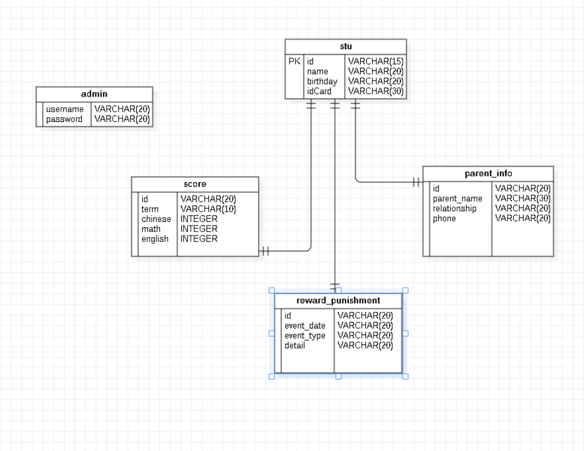
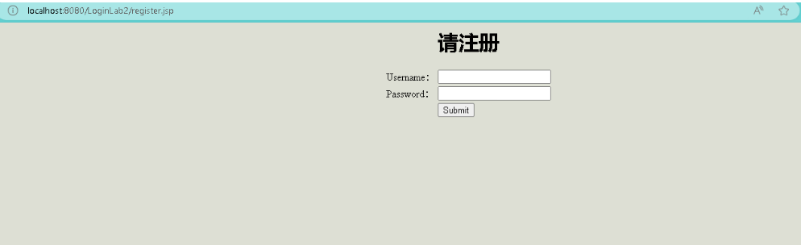
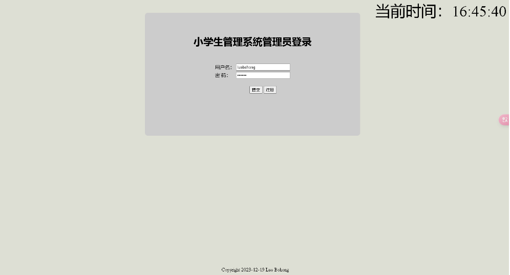
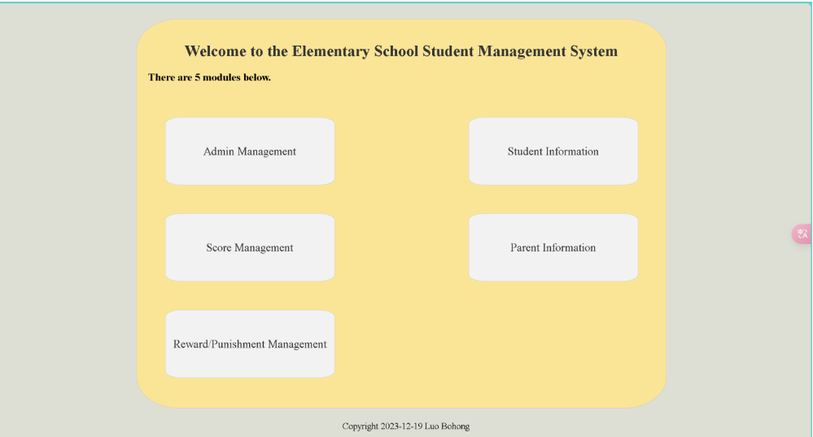
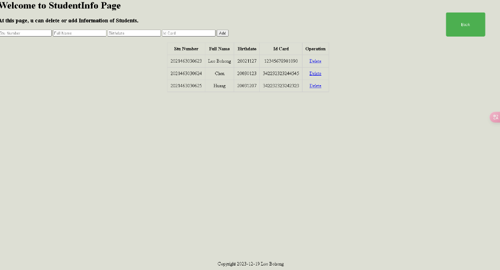
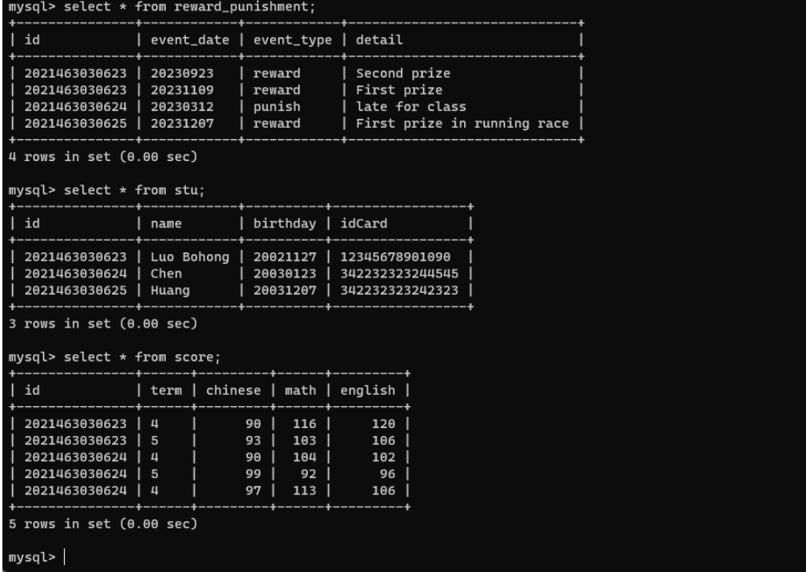

### #这是一个使用Java MVC架构开发的小学生管理系统

项目为本人于2023年开发，如今偷懒不去配置Mysql和Tomcat环境了，因此以下所使用图片均源于本人提交在作业系统的项目报告中。

该项目可供大家查阅学习~

#### 技术栈：

MVC架构、JSP、Servlet、JDBC、Apache Commons DBCP线程池库。

### 数据库设计

#### 部分运行图:

